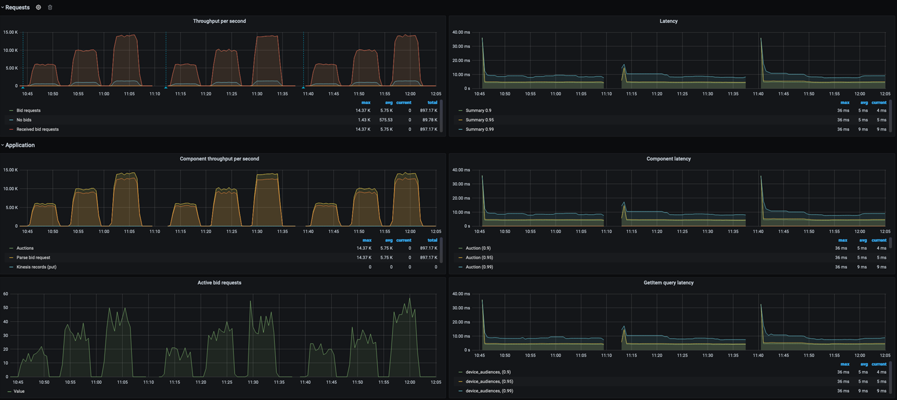

# RTB Codekit Deployment Guide

## Introduction

This document will help you deploy the Real Time Bidder (RTB) application on AWS along with a load-generator which will simulate the real-world bid requests. Both RTB and load-generator will be deployed in Amazon EKS cluster. 

You can deploy the RTB application either using a DynamoDB or Aerospike as database and Kinesis data streams writing the requests to S3. 

As part of the kit, you will also be deploying Grafana and Prometheus pods on the EKS cluster to collect and display the application logs such as the bid requests per second and latency.

## Recording reuse

The Industry Kit Program team reports on the impact that industry kits have for the AWS field and our customers. Don't forget to record reuse for every customer you show this to.

In order to do so, click the "Record project reuse" button on this kit’s BuilderSpace page and enter the SFDC opportunity ID or paste the link to your SFDC opportunity.


## Support

If you notice a defect, or need support with deployment or demonstrating the kit, create an Issue here: https://gitlab.aws.dev/industry-kits/adtechandmktg/aws-real-time-bidder/-/issues

## Prerequisites

1. You need the following to be installed on your local machine to access the EKS cluster and Grafana Dashboards

* [AWS CLI V2](https://docs.aws.amazon.com/cli/latest/userguide/install-cliv2.html)
* [Helm](https://helm.sh/)
* [kubectl](https://kubernetes.io/docs/tasks/tools/#kubectl)
* [JQ](https://stedolan.github.io/jq/download/)

2. On the AWS account that you will be deploying this kit you will need an IAM User with -

* Administrator and Programmatic access
* Git security credentials.

3. Service Limits - You can increase this limits via self-service portal in AWS Console. If this is being deployed on an Isenguard account, please follow [Fleet Management Request](https://fleet-management-console.amazon.com/public_aws_limit_requests/new) process.
* The DynamoDB table Read Capacity Unit (RCU) limit should be increased to 150,000 RCU's from deafult 40,000 RCU's
* Kinesis shards limit should be increased to 2048.
* Code-kit will be leveraging Graviton Spot instances M6g and C6g) and so make sure you have enough spot cores in available for your account in service quotas in AWS Console. Increase the limit to 200 cores.

## Architecture Diagram


## Deployment

1.	Download the code as Zip file from GitLab and unzip the file
2.	Log into AWS Console (Isengard Account). You can use an existing account or create a new account in Isengard to deploy this code-kit
3.	In the search bar, type code commit and go to code commit console
4.	In the code commit console, click on create a new repo. Follow the default settings. 


5.	In the new repository, go to the connection steps for HTTPS and copy the git clone repository command.


6.	Go to your local machine terminal, select a working folder/directory and paste the git clone command. It will ask you Git security credentials which you can refer from the prerequisites section.


7. Go to the cloned directory and copy the Gitlab code files downloaded in step 1. contents of the zipped folder should be under the cloned repo and not nested within another folder.

8. Execute below commands. These commands will push the application to codecommit repository we created above

``` 
    git add
    git commit -m “Initial Version for BidderApp”
    git push
```


9.	Observe the folder structure created in CodeCommit repository. Go to buildspec.yml file at the root directory and update the preconfigured AWS account number with your account number (blacked out in the picture below) and a stack name unique to you for e.g. yourname-date-BidderAppDemo.  Commit the changes. 


10.	Also go to the initialize-repo.sh file and update the preconfigured project name to a new value i.e. unique project name for you for e.g. yourname-date-BidderAppDemo. Commit the changes.

    If you are deploying this stack in region other than US-East-1 then you need to edit line 82 in initialize-repo.sh and add region to the command.


11.	You are now ready with code configuration set up.
12.	Go to CodePipeline service form your AWS console and click on create Pipeline. 


13.	Provide pipeline name, role name and leave default settings and click Next.


14.	Under Source, Select CodeCommit as source provider. Provide your repository name created in step 4. Branch name will be master. Leave default settings.


15.	Under Build, select CodeBuild. Click on Create Project. It will open a new window.


16. Provide Code Build project name. Select below options:
``` 
Operating system: Amazon Linux 2
Runtime: Standard
Image: aws/codebuild/amazonlinux2-aarch64-standard:2.0
Check the Priviledged option.
Make a note of new role name getting created
Leave default settings and continue to Codepipeline
```
17.	Open a new tab for AWS console and go to IAM. 
18.	Select the IAM role created in step 16 and add Administrator access policy and CodeCommitPowerUser policy.


19.	Come back to CodePipeline tab, and click Next. For deployment, select skip deployment stage. Click Finish.
20.	Your pipeline is now completed and started running. Wait for the pipeline to finish successfully. you may come across resource limitation problems around DynamoDB and Kinesis, please raise support ticket, and as a workaround for you to proceed, check below cloudformation parameters.
* dynamodb.yaml: DevicesReadMinCU, DevicesReadMaxCU
* application.yaml: KinesisBenchmarkMinShardCount, KinesisBenchmarkMaxShardCount


21. Once the code kit is deployed, you will see 10 CloudFormation stacks created in your account. Look for the root stack (It should be with the code commit repo name) and the application stack that looks like "(Code commit repo)-ApplicationStack-(Unique Id)" copy both the stack name.

22. On your local mcahine, open terminal, confiure your aws account and default_region.

```
aws configure
```
23. In the terminal, navigate to the repo folder and run the following commands. The follwing commands will set the variables in your terminal which can be used to connect to EKS cluster and run benchmarks

```
export AWS_ACCOUNT=<Account Number>

export AWS_REGION=<AWS Region>

export ROOT_STACK=<ROOT Stack Name>

export APPLICATION_STACK_NAME=`aws cloudformation list-exports --query "Exports[?Name=='ApplicationStackName'].Value" --output text`

export CODEBUILD_STACK_NAME=`aws cloudformation describe-stacks --stack-name ${ROOT_STACK} --output json | jq '.Stacks[].Outputs[] | select(.OutputKey=="CodebuildStackARN") | .OutputValue' | cut -d/ -f2`

export EKS_WORKER_ROLE_ARN=`aws cloudformation list-exports --query "Exports[?Name=='EKSWorkerRoleARN'].Value" --output text`

export EKS_ACCESS_ROLE_ARN=`aws cloudformation list-exports --query "Exports[?Name=='EKSAccessRoleARN'].Value" --output text`

export STACK_NAME=$APPLICATION_STACK_NAME

```
24. Now, let us connect to EKS cluster. We will assume EKS_ACCESS_ROLE and store the cluster creds in the local kubeconfig.
```
aws sts assume-role --role-arn $EKS_ACCESS_ROLE_ARN --role-session-name EKSRole-Session --output yaml
```
25. As output of above command you will get AccessKeyId, SecretAccessKey, and SessionToken. Copy them and pass them in to variables as shown below. 
```
export AWS_ACCESS_KEY_ID=<AccessKeyId>
export AWS_SECRET_ACCESS_KEY=<SecretAccessKey>
export AWS_SESSION_TOKEN=<SessionToken>
```
26. Run the following command to see if you are assuming the EksAccessRole
```
aws sts get-caller-identity
```

27. Now call the make eks@grant-access  traget file to get the creds to access EKS cluster by using the command below (This command has to be run in the code repo folder in terminal).
```
make eks@grant-access
```
28. We now have creds to login to EKS cluster. Unset the EksAccessRole using below command.
```
unset AWS_ACCESS_KEY_ID AWS_SECRET_ACCESS_KEY AWS_SESSION_TOKEN
```
29. Run the following command to connect to EKS cluster.
```
make eks@use
```
30. The following command will get you the pods in cluster and you must see the pods as shown in the screenshot below.
```
kubectl get pods
```


31. The below command will clean up the existing load generator container that was deployed during the initial phase. You need to run this command everytime you want to run a new deployment.
```
make benchmark@cleanup
```

32. Trigger the benchmark by initiating the load-generator along with the parameters.
```
make benchmark@run TIMEOUT=100ms NUMBER_OF_JOBS=1 RATE_PER_JOB=200 NUMBER_OF_DEVICES=10000 DURATION=500s
```
33. Connect to Grafana Dashboard.
```
kubectl port-forward svc/prom-grafana 8080:80
```
34. On your browser, access http://localhost:8080 and use the following credentials to login

```
username: admin
Password: prom-operator
```


35. Once you are login click on the dashboard button on the left hand menu and select manage shown in the figure below.


36. Search and access 'bidder' dashboard from the list.


37. You will see the bid request that are being generated on the right hand side and latency on the left hand side of the dashboard as shown in the figure below.



The metrics include:

* Bid requests generated
* Bid requests received
* No Bid responses
* Latency on 99, 95 and 90 pecentile

This benchmarks will help to demonstrate that the AdTech Real-time-bidder application performace on AWS Graviton instances.


# Notes
* deployment/infrastructure/charts/bidder/values.yaml:  KINESIS_DISABLE: "ture" # to disable kinesis
