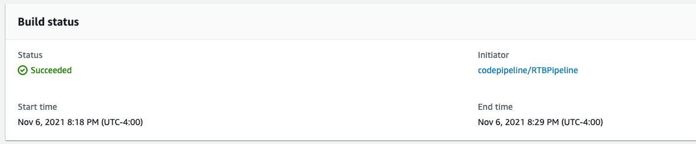
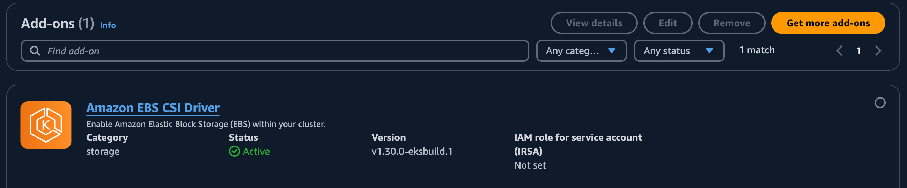
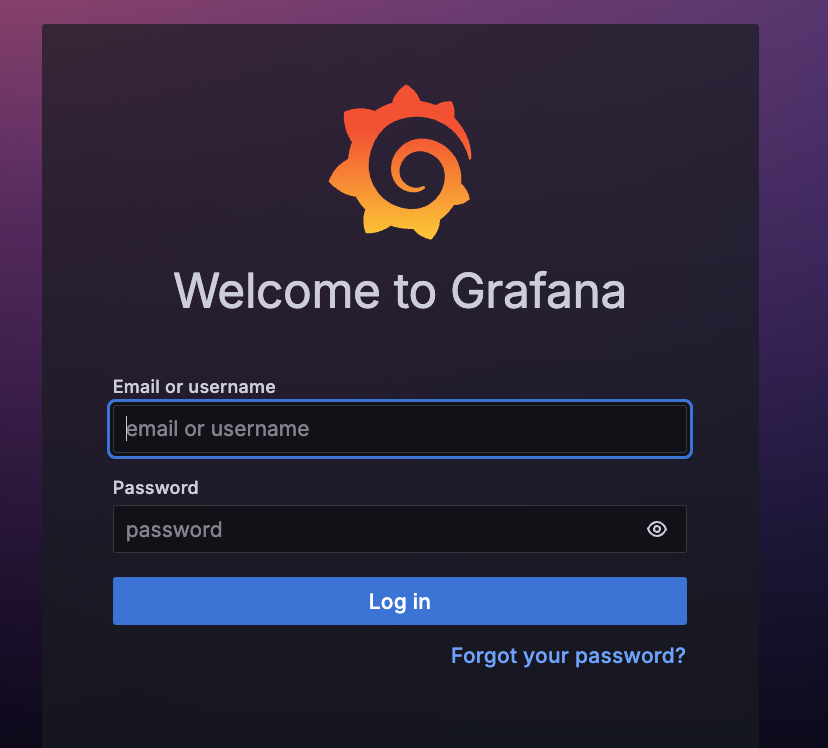
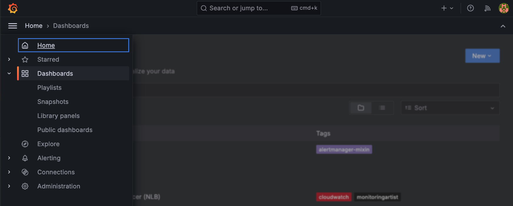
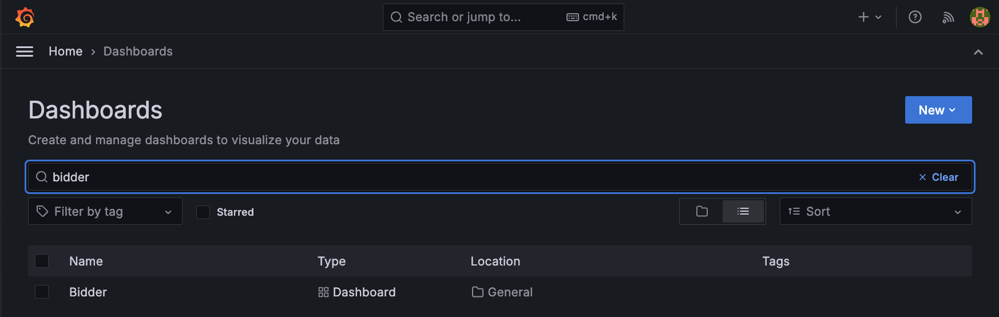

# Guidance for Building a Real Time Bidder for Advertising on AWS

### RTB Code Kit Deployment Guide
# Guidance for Building a Real Time Bidder for Advertising on AWS

### RTB Code Kit Deployment Guide

## Introduction

Real-time advertising platforms operate round-the-clock, processing millions of transactions, running bidding, ad serving, and verification workloads at ultra-low latency and high throughput. 

In this industry, expenses associated with infrastructure costs such as compute, databases, and networking significantly impact profit margins. Consequently, ad tech firms are driven to constantly maximize the price-performance of their platforms.

This AWS Solution, "Guidance for Building a Real Time Bidder for Advertising on AWS" presents a deployable reference architecture that leverages open-source technologies to showcase the "art of the possible" in the advertising space. This blueprint empowers demand-side platforms (DSP) to develop advanced, innovative, and smart bidding services. 

The Real-Time Bidder Solution on AWS consists of 5 modules: 

1. **Data generator**: Generates synthetic data for the device, campaign, budget, and audience. The size of each table can be defined in the configuration file, it is recommended that one billion devices be generated for the devices table, one million campaigns and associated budgets, and one hundred thousand audiences.

2. **Load generator**: Generates artificial bid requests (based on the OpenRTB 2.5 or OpenRTB 3.0 standard).

3. **Bidder**: Receives and parses bid requests, searches for the device and associated metadata in the device table, selects the best fitting campaign, determines the bid price for the ad opportunity, constructs the bid request/response, and writes the bid request/response to a data pipeline. 

4. **Data repository**: Database for storing device, campaign, budget, and audience data. Supports either DynamoDB or Aerospike.

5. **Data Pipeline**: Receives, aggregates and writes the bid request and response to a data repository. Includes tools to ingest the metrics generated by the bidder and displays the results for evaluation.

6. **Monitoring Tools**: Uses Grafana and Prometheus on Amazon Elastic Kubernetes Service (EKS) to collect and display application logs such as the bid requests per second and latency.

## Prerequisites

1. Python 3

2. Ensure the AWS CLI and AWS CDK are installed on your local machine. These are used to access the EKS cluster and Grafana Dashboards:
    * [AWS CLI V2](https://docs.aws.amazon.com/cli/latest/userguide/install-cliv2.html)
    * [AWS CDK](https://docs.aws.amazon.com/cdk/v2/guide/getting_started.html#:~:text=The%20actual%20package%20name%20of%20the%20main%20CDK%20package%20varies%20by%20language.) 

3. The following packages are required and can be installed using the helper script [client-setup.sh](./client-setup.sh):
    * [Helm 3.8.2](https://helm.sh/)
    * [kubectl 1.21.0](https://kubernetes.io/docs/tasks/tools/#kubectl)
    * [JQ](https://stedolan.github.io/jq/download/)

4. Create an IAM user with the following permissions in the AWS account that you will be deploying this solution:
    * Administrator and Programmatic access
    * GitHub repository creation and write access

5. The [CDK code](./cdk/pipeline) deploys a code pipeline and automates the deployment of the components. The code pipeline requires a supported Git repository (GitHub or Bitbucket) as the source. In this example we are using GitHub. Follow these steps to create a GitHub repo:
    1. Create a new GitHub repo as a fork of the opensource. Follow the instructions [here](https://docs.github.com/en/pull-requests/collaborating-with-pull-requests/working-with-forks/fork-a-repo)
    2. Create an OAuth Personal Access Token with read access to the repository and read/write access to Webhooks. Follow instructions [here](https://docs.github.com/en/authentication/keeping-your-account-and-data-secure/managing-your-personal-access-tokens#creating-a-fine-grained-personal-access-token).

6. Create a new secret in AWS Secrets Manager via the AWS Console to store the GitHub Personal Access Token (PAT) from the step above. Ensure you are in the correct region:
    1. Login to the AWS console and navigate to AWS Secrets Manager.
    2. Select `Store a new secret`, click `Other type of secret`, use the `plaintext` option and save the GitHub PAT from the step above. 
        >NOTE Don’t use the key value pair nor the Json format. 
    3. Enter a name for the secret. This name is required in the cdk context file later on.
    4. Leave the rest as default and store the secret.

### Service Limits

Increase the following service limits via Service Quotas section in AWS Console.
* DynamoDB table Read Capacity Unit (RCU) limit should be increased to 150,000 RCU's from default 40,000 RCU's. The limit is called `Table-level read throughput limit` under the `Amazon DynamoDB` service quota.
* Kinesis shards limit should be increased to 2048. The limit is called `Shard per Region` under `Amazon Kinesis Data Streams` service quota.

## Architecture Diagram


## Deployment

1. Clone this repo to your local machine.
2. Open the terminal on your local machine and configure your AWS credentials profile (Secret ID and Token), region and output using the following command:
    ```
    aws configure --profile rtb
    ```
3. Run the following command to setup to connection from AWS CodeBuild on your AWS account to the GitHub repo:
    ```
    aws codebuild import-source-credentials --server-type GITHUB --auth-type PERSONAL_ACCESS_TOKEN --token <token_value> --profile rtb
    ```
    You should receive a response similar to the following:
    ```
    {
        "arn": "arn:aws:codebuild:<region>:<account-number>:token/github"
    }
    ```
4. Navigate to `aws-real-time-bidder/cdk/pipeline` in your terminal or IDE and copy `cdk.context.json.example` file to `cdk.context.json`:
    ```
    cd cdk/pipeline
    cp cdk/pipeline/cdk.context.json.example cdk/pipeline/cdk.context.json
    ```

5.  Update the `GITHUB_TOKEN_SECRET_ID`,`ROOT_STACK_NAME`,`STACK_VARIANT` (DynamoDB/Aerospike) and variables on the `cdk.context.json`:
    ```
    {
        "dev": {
            "REPO_BRANCH":"main",
            "GITHUB_TOKEN_SECRET_ID": "rtbkit-github-token" #-- AWS SecretManager secret name
        },
        "shared": {
            "ROOT_STACK_NAME": "aws-rtbkit",
            "STACK_VARIANT": "DynamoDB", #-- [DynamoDB|Aerospike]
            "REPO_OWNER":"", #-- Owner of the fork repo
            "REPO_NAME":"" #-- Name of the fork repo
        }
    }
    ```
6.  Check if python3 and the python3 virtual environment are installed on your machine if not install python3:
    ```
    sudo apt-get install python3
    python3 --version
    ```
7. Create a python3 virtual environment and install the requirements and boto3 libraries:
    ```
    python3 -m venv .venv
    source .venv/bin/activate
    pip3 install -r requirements.txt
    ```
8. Deploy the CDK stack:
    ```
    cdk bootstrap --profile rtb
    cdk deploy --profile rtb
    ```
9. CDK will deploy the resources as shown below:

    
    

10. On successful deployment you will see as following
    ```
    ✅ RTBPipelineStack
    ```

11. After the CDK deployment is complete, a CodePipeline will start and deploy the `Real-Time-Bidding Solution` in your AWS Account using CloudFormation. This will take approximately thirty minutes. Once successful you will see:

    

12. Open AWS console and navigate to EKS service. Locate the cluster deployed by the stack. Navigate to Add-ons tab and install the Amazon EBS CSI Driver add on:
    > **IMPORTANT**: Select `Optional configuration schema` and click select `Override` for the `Conflict resolution method` 
    
    

13. Once the deployment is completed go to the CloudFormation console and navigate to root stack (this will be the stack with name that you have provided in cdk.json file in step 4). Go to Outputs tab and copy `ApplicationStackName`, `ApplicationStackARN`, `EKSAccessRoleARN`, `EKSWorkerRoleARN`. We will be using them in the following steps.

14. Ensure the pre-requisites (`Helm`, `Kubectl` and `jq`) are installed on the local/client machine as per the pre-requisites section above.
    > Tip: The pre-requisites can be installed using the shell script [client-setup.sh](./client-setup.sh). Navigate to the root directory and change the script permissions `chmod 700 client-setup.sh` before running the script.

    >NOTE: Commands for steps 15 - 22 are included in a shell script [run-benchmark.sh](./run-benchmark.sh). Navigate to the directory and change the script permissions `chmod 700 client-setup.sh` if required before running the script.

15. Open a command terminal in your local/client machine, navigate to the repository folder and run the following commands. The following commands will set the variables in your terminal which are used to connect to EKS cluster and run benchmarks:

    >NOTE: Ensure you specify the correct `--profile` and `--region` in the commands below

    ```
    export AWS_ACCOUNT=<Account Number>

    export AWS_PROFILE=<Aws Profile Name>

    export AWS_REGION=<AWS Region>

    export ROOT_STACK=<ROOT Stack Name>

    export APPLICATION_STACK_NAME=`aws cloudformation list-exports --query "Exports[?Name=='ApplicationStackName'].Value" --output text`

    export CODEBUILD_STACK_NAME=`aws cloudformation describe-stacks --stack-name ${ROOT_STACK} --output json | jq '.Stacks[].Outputs[] | select(.OutputKey=="CodebuildStackARN") | .OutputValue' | cut -d/ -f2`

    export EKS_WORKER_ROLE_ARN=`aws cloudformation list-exports --query "Exports[?Name=='EKSWorkerRoleARN'].Value" --output text`

    export EKS_ACCESS_ROLE_ARN=`aws cloudformation list-exports --query "Exports[?Name=='EKSAccessRoleARN'].Value" --output text`

    export STACK_NAME=$ROOT_STACK
    ```
16. Now, run the following command to assume EKS_ACCESS_ROLE to connect to the EKS cluster:
    ```
    CREDS_JSON=`aws sts assume-role --role-arn $EKS_ACCESS_ROLE_ARN \
        --role-session-name EKSRole-Session --output json`
    ```
    >Note: You may need to manually configure AWS CLI credentials using `aws configure` if the temporary tokens don’t work.

17. Output of above command you will give you AccessKeyId, SecretAccessKey, and SessionToken. Run the following command to export them to environment variables:
    ```
    export AWS_ACCESS_KEY_ID=`echo $CREDS_JSON | jq '.Credentials.AccessKeyId' | tr -d '"'`
    export AWS_SECRET_ACCESS_KEY=`echo $CREDS_JSON | jq '.Credentials.SecretAccessKey' | tr -d '"'`
    export AWS_SESSION_TOKEN=`echo $CREDS_JSON | jq '.Credentials.SessionToken' | tr -d '"'`
    CREDS_JSON=""
    ```
18. Now run the `make` command to access the EKS cluster by:
    >NOTE: This command has to be run from the root folder of the code repository:

    ```
    make eks@grant-access
    ```

19. Run the following command to connect to EKS cluster:
    ```
    make eks@use
    ```

20. Run the following command to list the pods in cluster. You should see the pods as shown in the screenshot below.
    ```
    kubectl get pods
    ```

    

21. The below command will clean up the existing load generator container that was deployed during the initial deployment. You need to run this command every time you want to run a new benchmark. Use the script [run-benchmark.sh](./run-benchmark.sh) that automates 21-22.
    ```
    make benchmark@cleanup
    ```
    
22. Start the benchmark by initiating the load-generator along with the parameters.
    ```
    make benchmark@run TIMEOUT=100ms NUMBER_OF_JOBS=1 RATE_PER_JOB=200 NUMBER_OF_DEVICES=10000 DURATION=500s
    ```
    _You can supply following parameters to load-generator and perform benchmarks_
    ```
    TIMEOUT=100ms        # Request timeout (default 100ms)
    DURATION=500s        # duration of the load generation
    RATE_PER_JOB=5000    # target request rate for the load generator
    NUMBER_OF_DEVICES=10 # number of devices IFAs to use in bid request
    NUMBER_OF_JOBS=1     # number of parallel instances of the load generator
    SLOPE=0              # slope of requests per second increase (zero for a constant rate; see <https://en.wikipedia.org/wiki/Slope>)
    ENABLE_PROFILER=1    # used to start profiling session, leave unset to disable
    ```

23. Once the load-generator is started you can run the following port-forward command to connect to Grafana Dashboard.
    ```
    kubectl port-forward svc/prom-grafana 8080:80
    ```

24. On your local/client instance open the URL [localhost:8080](http://localhost:8080) access Grafana Dashboard. 
Use the following credentials to login (Turn off enhanced tracking if you are using Firefox)

    ```
    username: admin
    Password: prom-operator
    ```

    

25. Once you login, click on the dashboard button on the left hamburger menu and select manage as shown in the figure below.

    

26. Search and access 'bidder' dashboard from the list.

    

27. You will see the bid request that are being generated on the right side and latency on the left side of the dashboard as shown in the figure below.

    

The metrics include:

* Bid requests generated
* Bid requests received
* No Bid responses
* Latency on 99, 95 and 90 percentiles

These benchmarks help demonstrate the Real-time-bidder application performance on AWS Graviton instances.

>IMPORTANT :  After running the benchmark delete the stack to avoid incurring AWS cloud costs

>TIP: You can also change the DynamoDB and kinesis configurations to use on-demand compute instead of provisioned. This will reduce the cost of running the resources in the stack. In addition to this go to EKS and set the max and desired count of node in all node groups to 0. This will automatically terminate all the running EC2 instances launched by the stack. These two changes could reduce the running cost to 1/10th. As of June 2024, the average running cost of the stack with basic configuration is around $800/day in us-west-2

# Notes
* You can disable the data pipeline by setting KINESIS_DISABLE: "true" in deployment/infrastructure/charts/bidder/values.yaml file
* We have used unsafe pointers to optimize the heap allocation and are not converting the pointer types in the code. If this code is used in production, we strongly recommend you to look at your current code and set the pointer type in ./apps/bidder/code/stream/producer/batch_compiler.go file.
* For the ease of deployment, we have pre-configured user credentials for Grafana Dashboard. This is not a best practice and we strongly recommend you to configure access via AWS IAM/SSO. (./deployment/Infrastructure/deployment/prometheus/prometheus-values.yaml, ./tools/benchmark-utils/function.sh)
* Since CloudTrail is enabled on the AWS account by default. we strongly recommend not to disable it. We have not made any CloudTrail configuration on the code kit to enable it if it is disabled.
* Use [update-node-group-size.sh](./update-node-group-size) to downsize the EKS cluster to zero to save compute costs while testing
* Use [check-pod-logs.sh](./check-pod-logs.sh) to get the bidder logs for troubleshooting purposes

# How to use ALB with RTB Kit

1. Install ALB controller via helm refer - https://docs.aws.amazon.com/eks/latest/userguide/lbc-helm.html
2. Attach Policy "AWSLoadBalancerControllerIAMPolicy" to the EKSWorkerRole "$cluster-name-EksWorkerRole"
3. add tags to subnet kubernetes.io/cluster/eks-alb
4. Make sure subnet route table is pointing to inter gateway
5. Create ingress resource which should provision ALB (ingress file is already placed in current directory)
6. EDIT deployment/infrastructure/Makefile with below
--->  TARGET="http://\<elb url>/bidrequest"
7. Remove below line from deployment/infrastructure/charts/load-generator/templates/job.yaml
    ```
    <           - --track-errors={{ .Values.trackErrors }}
    <       {{- if $.Values.waitForService.enable }}
    <       initContainers:
    <         - name: wait-for-service
    <           image: "{{ .Values.public_ecr_registry }}/{{ .Values.waitForService.image }}"
    <           env:
    <             - name: TARGETS
    <               value: {{ include "load-generator.waitForServiceTargets" $ }}
    <           args:
    <             - 'sh'
    <             - '-c'
    <             - |
    <               for TARGET in $TARGETS; do
    <                 until wget --spider --no-check-certificate -T 5 $TARGET; do
    <                   echo "Still waiting for $TARGET..."
    <                   sleep 1;
    <                 done;
    <               done;
    <       {{- end }}
    <       securityContext:
    <         {{- toYaml .Values.podSecurityContext | nindent 8 }}  
    <shared
    ```
8. run the load generator and monitor ALB metrics for traffic