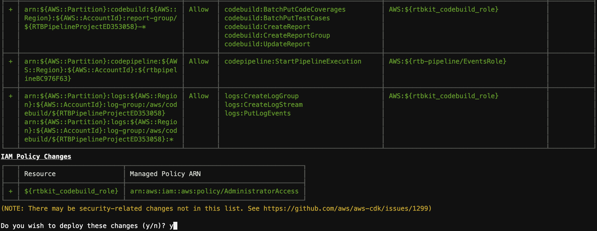

# RTB Codekit Deployment Guide

## Introduction

Real-time advertising platforms running bidding, ad serving, and verification workloads operate at ultra-low latency with throughput in the millions of transactions per second —24 hours a day. The scale of advertising technology (ad tech) platform request volume is so large that customers often measure infrastructure costs on unit basis per billion requests. Infrastructure costs for compute, databases, and networking also directly affect profit margins in ad tech—creating a strong incentive for customers to optimize price-performance.

The Real-Time Bidding on AWS Solution is a deployable reference architecture demonstrating the "art of the possible" and enabling DSPs to jumpstart development of innovative smart bidding services. Using the Real-Time Bidding on AWS Solution, demand side partners can rapidly deploy and build upon an open source architecture to enable the fast assessment of ad opportunities at scale, and focus on the bid assessment rather than non-differentiated processing logistics.

The Real-Time Bidder Solution on AWS consist of 5 modules: 

1.  **Data generator** to generate synthetic data for the device, campaign, budget, and audience. The size of each table can be defined in the configuration file, it is recommended that 1 Bn devices be generated for the devices table, 1 million campaigns and associated budgets, and one hundred thousand audiences.

2. **Load generator** to generate artificial bid requests (based on the OpenRTB 2.5 or OpenRTB 3.0 standard).

3. **Bidder** to receive the bid requests, parse the bid requests, find the device in the device table and associated meta data, select the best fitting campaign, determine the price to bid for the ad opportunity, constrict the bid request response, return the bid request response, and write the bid request and bid request response to a data pipeline. 

4. **data repository** for the device, campaign, budget, and audience data. You can choose from DynamoDB or Aerospike.

5. **Data Pipeline** that receives, aggregates and writes the bid request and the bid request response to a data repository, and /6 a set of tools to ingest the metrics generated by the bidder and display the results for evaluation.

6. **Monitoring Tools**, Grafana and Prometheus on the EKS cluster to collect and display the application logs such as the bid requests per second and latency.

## Prerequisites

1. You need the following to be installed on your local machine to access the EKS cluster and Grafana Dashboards

* [AWS CLI V2](https://docs.aws.amazon.com/cli/latest/userguide/install-cliv2.html)
* [AWS CDK](https://docs.aws.amazon.com/cdk/v2/guide/getting_started.html#:~:text=The%20actual%20package%20name%20of%20the%20main%20CDK%20package%20varies%20by%20language.) 

2. As part of the deployment the solution will also create an isolated VPC and Cloud9 instance to access EKS clsuter and Grafana dashboards. You need to install the following on the cloud9 instances to run the benchmarks.
* [Helm 3.8.2](https://helm.sh/)
* [kubectl 1.21.0](https://kubernetes.io/docs/tasks/tools/#kubectl)
* [JQ](https://stedolan.github.io/jq/download/)

3. On the AWS account that you will be deploying this kit you will need an IAM User with -

* Administrator and Programmatic access
* Git security credentials.
* If you already are using cloud9 in the AWS Account you also have AWSCloud9SSMInstanceProfile policy in your IAM Policy and you don't have to create it again. Comment AWSCloud9SSMInstanceProfile object in deployment/infrastructure/templates/cloud9.yaml file (line number 40)

### 4. Service Limits - 

You can increase the following limits via service quota portal in AWS Console.
* DynamoDB table Read Capacity Unit (RCU) limit should be increased to 150,000 RCU's from deafult 40,000 RCU's
* Kinesis shards limit should be increased to 2048.
* Code-kit will be leveraging Graviton Spot instances M6g and C6g and so make sure you have enough spot cores available for your account. You can quickly verify this via service quotas portal in AWS Console. Increase the limit to 200 cores.

## Architecture Diagram


## Deployment

1.	Download the code as Zip file and unzip the file `aws-real-time-bidder`
2.  Open terminal on your loacal machine and configure your AWS credentials (Secret ID and Token), region and output using the following command
```
aws configure
```
3.  navigate to `aws-real-time-bidder/cdk/pipeline` on your terminal or IDE and edit `cdk.json` file
```
cd cdk/pipeline
vi cdk.json
```

4.  Update the `AWS_ACCOUNT_ID`, `RTBKIT_ROOT_STACK_NAME`,`RTBKIT_VARIANT` (DynamoDB/Aerospike) variables on the `cdk.json` file available in the above mentioned location (in step 3)

5.  Check if python3 and python3 virtual environment is installed on your machine if not install python3 
```
sudo apt-get install python3
sudo apt-get install python3.8-venv
python3 --version
```
6. create python3 virtual environment and install the requirements and boto3 libraries.
```
python3 -m venv .venv
source .venv/bin/activate
pip3 install -r requirements.txt
pip3 install aws-cdk.aws-codecommit aws-cdk.aws-codebuild \
    aws-cdk.aws-codepipeline aws-cdk.aws_codepipeline_actions aws-cdk.pipelines
```
7. Deploy the CodeCommit, CodeBuild and CodePipeline using CDK by running the following commands
```
cdk bootstrap
cdk deploy
```
8. CDK will deploy the resources as shown below.




9. On successful deployment you will see as following
```
✅ RTBPipelineStack
```
10. Login to AWS Console and navigate to AWS CodeCommit console. From the console get the clone URL as shown in the figure below. (your AWS user account should have git credentials in order to clone or update repo. You can find more information [here](https://docs.aws.amazon.com/codecommit/latest/userguide/setting-up-gc.html))


```
git clone <URL>
```

11. You have clone the empty repo that was created as part of the CDK deployment. Now, copy the contents of the downloaded repo in step 1 to the new cloned codecommit repo and commit the changes.

```
git add .
git commit -m "initial commit"
git push
```
12. Now your pipeline will be triggered and the Real-Time-Bidding Solution will start deploying on your AWS Account and eventually you will see that the CodePipeline is sucessful.


13. Once the deployment is completed go to the cloudformation console and navigate to root stack (this will be the stack with name that you have provided in cdk.json file in step 4). Go to Outputs tab and copy `ApplicationStackName`, `ApplicationStackARN`, `EKSAccessRoleARN`, `EKSWorkerRoleARN`, `Cloud9IDE-URL`, and `Cloud9EnvID`. We will be using them in next steps.

14. As part of the deployment pipeline, you have also deployed a cloud9 instance. Run the following command to enable access to the Cloud9 instance. you can find more info [here](https://docs.aws.amazon.com/cloud9/latest/user-guide/share-environment.html)
```
aws cloud9 create-environment-membership --environment-id <Environment ID> --user-arn USER_ARN --permissions PERMISSION_LEVEL
```
>Note: If the cloud9 deployment fails or doesnt create an instance, use the [cloud9.yaml file](./deployment/infrastructure//templates/cloud9.yaml) to manually deploy the cloud9 instance

15. Access the Cloud9 IDE using the URL that you have copied from step 13. Deploy the pre-requisits (`Helm`, `Kubectl`and `jq`) on the Cloud9 Instance as mentioned in the prereqisits session.
>Tip: Commands for steps 15 - 26 are inlcuded in a shell script [cloud9-setup.sh](./cloud9-setup.sh) and is accessible from the code repo copy that gets pulled down automatically when you lauch the Cloud9 instance created by the stack. Navigate to the directory and change the script permissions `chmod 700 cloud9-setup.sh` before executing the script.
16. In the cloud9 terminal, clone the CodeCommit repo as you have done in step 10. 

17. On terminal, navigate to the repository folder and run the following commands. The follwing commands will set the variables in your terminal which are used to connect to EKS cluster and run benchmarks

```
export AWS_ACCOUNT=<Account Number>

export AWS_REGION=<AWS Region>

export ROOT_STACK=<ROOT Stack Name>

export APPLICATION_STACK_NAME=`aws cloudformation list-exports --query "Exports[?Name=='ApplicationStackName'].Value" --output text`

export CODEBUILD_STACK_NAME=`aws cloudformation describe-stacks --stack-name ${ROOT_STACK} --output json | jq '.Stacks[].Outputs[] | select(.OutputKey=="CodebuildStackARN") | .OutputValue' | cut -d/ -f2`

export EKS_WORKER_ROLE_ARN=`aws cloudformation list-exports --query "Exports[?Name=='EKSWorkerRoleARN'].Value" --output text`

export EKS_ACCESS_ROLE_ARN=`aws cloudformation list-exports --query "Exports[?Name=='EKSAccessRoleARN'].Value" --output text`

export STACK_NAME=$ROOT_STACK
```
18. Now, run the following command to assume EKS_ACCESS_ROLE to connect to the EKS cluster.
```
CREDS_JSON=`aws sts assume-role --role-arn $EKS_ACCESS_ROLE_ARN \
    --role-session-name EKSRole-Session --output json`
```
>Note: You may need to manually configure AWS CLI credentials using `aws configure` if the temporary cloud9 tokens doesnt work.
19. As output of above command you will get AccessKeyId, SecretAccessKey, and SessionToken. Copy them and pass them in to variables as shown below. 
```
export AWS_ACCESS_KEY_ID=`echo $CREDS_JSON | jq '.Credentials.AccessKeyId' | tr -d '"'`
export AWS_SECRET_ACCESS_KEY=`echo $CREDS_JSON | jq '.Credentials.SecretAccessKey' | tr -d '"'`
export AWS_SESSION_TOKEN=`echo $CREDS_JSON | jq '.Credentials.SessionToken' | tr -d '"'`
CREDS_JSON=""
```
20. Now call the make eks@grant-access target file to access EKS cluster by using the command below (This command has to be run in the code repository folder in terminal).
```
make eks@grant-access
```
21. We now have creds to login to EKS cluster. Unset the EksAccessRole using below command.
```
unset AWS_ACCESS_KEY_ID AWS_SECRET_ACCESS_KEY AWS_SESSION_TOKEN
```
22. Run the following command to connect to EKS cluster.
```
make eks@use
```
23. The following command will get you the pods in cluster and you must see the pods as shown in the screenshot below.
```
kubectl get pods
```


24. The below command will clean up the existing load generator container that was deployed during the initial deployment. You need to run this command everytime you want to run a new benchmark.
```
make benchmark@cleanup
```

25. Trigger the benchmark by initiating the load-generator along with the parameters.
```
make benchmark@run TIMEOUT=100ms NUMBER_OF_JOBS=1 RATE_PER_JOB=200 NUMBER_OF_DEVICES=10000 DURATION=500s
```
_You can supply following parameters to load-generator and perform benchmarks_
```
TIMEOUT=100ms        # Request timeout (default 100ms)
DURATION=500s        # duration of the load generation
RATE_PER_JOB=5000    # target request rate for the load generator
NUMBER_OF_DEVICES=10 # number of device IFAs to use in bid request
NUMBER_OF_JOBS=1     # number of parallel instances of the load generator
SLOPE=0              # slope of requests per second increase (zero for a constant rate; see <https://en.wikipedia.org/wiki/Slope>)
ENABLE_PROFILER=1    # used to start profiling session, leave unset to disable
```
26. Once the load-generator is triggered you can run the following port-forward command to connect to Grafana Dashboard.
```
kubectl port-forward svc/prom-grafana 8080:80
```
27. On your cloud9 instance click and preview button on the top to open a browser window/tab and access Grafana Dashboard. Use the following credentials to login

```
username: admin
Password: prom-operator
```


28. Once you login, click on the dashboard button on the left hand menu and select manage as shown in the figure below.


29. Search and access 'bidder' dashboard from the list.


30. You will see the bid request that are being generated on the right hand side and latency on the left hand side of the dashboard as shown in the figure below.


The metrics include:

* Bid requests generated
* Bid requests received
* No Bid responses
* Latency on 99, 95 and 90 pecentile

This benchmarks will help to demonstrate that the AdTech Real-time-bidder application performace on AWS Graviton instances.


# Notes
* You can disable the data pipeline by setting KINESIS_DISABLE: "ture" in deployment/infrastructure/charts/bidder/values.yaml file
* We have used unsafe pointers to optimise the heap allocation and are not converting the pointer types in the code. If this code is used in production, we strongly recommand you to look at you current code and set the pointer type in ./apps/bidder/code/stream/producer/batch_compiler.go file.
* For the ease of deployment, we have pre-configured user credentials for Grafana Dashboard. This is not a best practice and we strongly recommand you to configure access via AWS IAM/SSO. (./deployment/Infrastructure/deployment/prometheus/prometheus-values.yaml, ./tools/benchmark-utils/function.sh)
* Since CloudTrail is enabled on the AWS account by default. we strongly recommand not to disable it. We have not made any cloudtrail configuration on the codekit to enable it if it is disabled.
>IMPORTANT :  Executing the bench mark, collecting data and deleting the stack is recommended to keep costs under control

