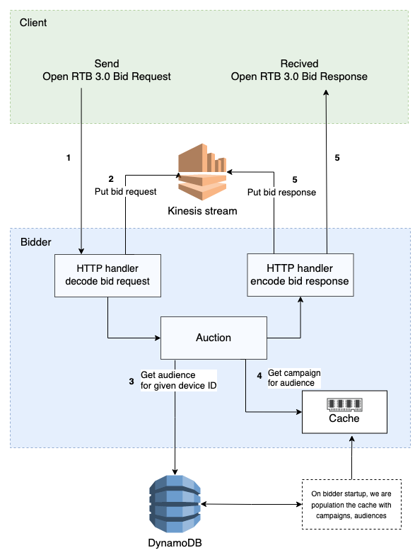

Overview of bidder application. [Here is link to the editable diagram.](https://app.diagrams.net/#G1KKabdL3NOQlOdDqZZ5mfz-BsftgNIhPH)

## Data structures

* campaign: currently ID string and MaxCPM float
* request: bid request (OpenRTB 3.0), bid request context (AdCOM 1.0), device ID
* device ID: converted from a text UUID representation to the 16 byte binary representation used in our DynamoDB
  schemas (so e.g. both Apple IDFA and Android Advertising ID can be handled as received in bid requests documented by
  [BidSwitch](https://protocol.bidswitch.com/rtb/context-device.html))

## Server

* using `net/http` and `github.com/gorilla/mux`
* parses bid requests and builds bid responses using `encoding/json` and `github.com/mxmCherry/openrtb`

See the [ADR](../adr/AB-64-bid-request-parsing.md) for the requirements of bid request
support and an initial optimization plan.

### Miscellaneous server endpoints

* healthcheck (used to check if the server is running)
* metrics exported to Prometheus (not available via the load balancer)
* `net/http/pprof` profiler endpoints (not available via the load balancer)

## Auction

* until integrated with the database, has mock campaigns
* until integrated with the budget cache, has random price and responds with no bid depending on 10% of random prices
* chooses campaign (highest MaxCPM)
* builds bid response (compliant with OpenRTB 3.0 and AdCOM 1.0, providing placeholder values of realistic sizes and
  complexity instead of creative data)

## Database

* queries DynamoDB on each device ID to find matching audiences
* can be disabled for benchmarking bidder without DynamoDB

The design is based on the first step of the [Steps to improve the user data serving](../adr/AB-1-steps-to-improve-the-user-data-serving.md) ADR.

## Stream

* sends bid requests and bid responses (JSON request/response bodies) [aggregated in the format used by KPL](https://github.com/awslabs/amazon-kinesis-producer/blob/master/aggregation-format.md) to AWS Kinesis
* currently implemented as a wrapper for `github.com/ouzi-dev/kinesis-producer` (a fork of
  `github.com/a8m/kinesis-producer` with Prometheus metrics export)
* Kinesis requests occur in a separate goroutine and use AWS SDK for Go
* can be disabled for benchmarking, not writing anything to Kinesis

We are not using the [Amazon Kinesis Producer Library](https://github.com/awslabs/amazon-kinesis-producer), since it
has only a Java frontend and rumored performance issues. Future optimization plans might require replacing
`github.com/ouzi-dev/kinesis-producer` and AWS SDK for Go by custom code inspired by the KPL architecture.

One of the known limitations is that currently we are using single stream for both bid requests and bid responses.
In the future we would like ho have separate streams for both of them.

## Cache

* loads campaign and audience to campaigns mapping from DynamoDB, and stores this data in memory
* data is loaded on bidder startup, and is not being synced with DynamoDB during runtime
* if cache does not have campaign, or mapping of audience to campaign, we fallback to DynamoDB query

Cache is right now implemented using go primitive structures of Go, like `map[string]database.Campaign` or `map[string][]string`.
The cache is described in [Steps to improve the user data serving](../adr/AB-1-steps-to-improve-the-user-data-serving.md) ADR

## Budget cache

Planned component: specified in an [ADR](../adr/AB-68-budget-cache.md), not implemented yet.
