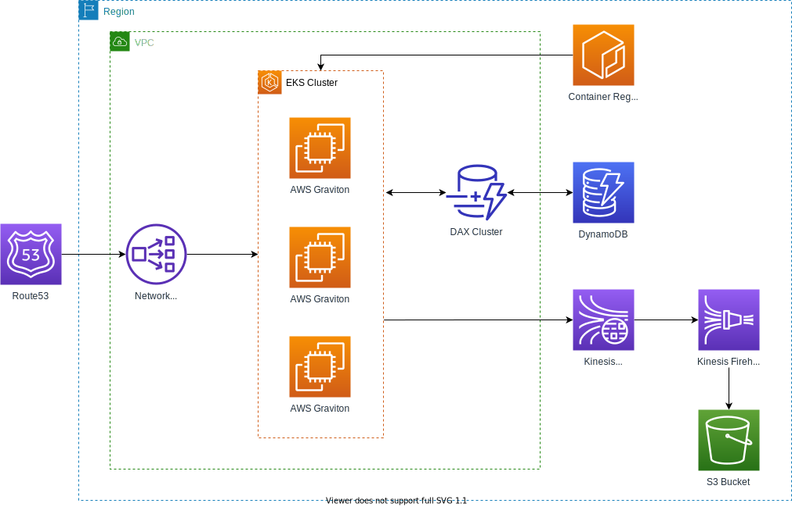

## Architecture overview

The infrastructure consist of following components:

* [Compute cluster](#compute-cluster)
* [Database](#database)
* [Analytics](#analytics)

### Compute cluster

Compute cluster is the main part of the infrastructure. It is responsible for the bidder and running the Prometheus stack.
The cluster utilizes AWS Elastic Kubernetes Service with a node group of spot AWS Graviton 2 instances.

Currently (2021-02-12), the `m6g.16xlarge` instances are used - the most powerful Graviton-based instances that
provide 64 vCPUs, 256 GiB of memory, and 25 Gbps of network bandwidth. 

### Database

AWS DynamoDB is a fully managed NoSQL database. The bidder uses it as the main storage for campaigns and device data. 
DynamoDB is configured in provisioned billing mode to ensure desired throughput and cost predictability. 

Along with DynamoDB, there is DAX cluster deployed. AWS DynamoDB Accelerator (DAX) is fully managed 
in-memory cache for DynamoDB. 

### Analytics

At the moment the analytics component is responsible for archiving bid requests and bid responses for further analysis
in later stages of the project. The bidder streams bid requests and responses to AWS Kinesis Data Stream. 
Captured data are transferred to S3 Bucket using AWS Kinesis Data Firehose. 
